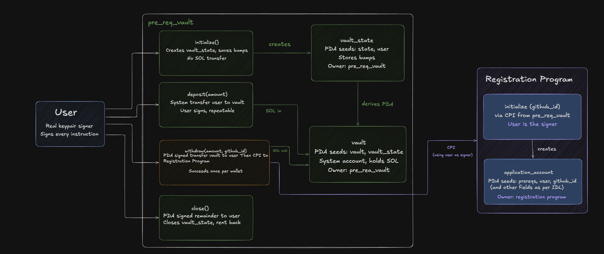

# Anchor Vault + Registration CPI

A SOL vault built with Anchor. The `withdraw` instruction was extended to perform a
Cross-Program Invocation into a separate registration program, which records a
GitHub username on-chain.

**Devnet** vault `Bmq56vNbjrGvzhqxBunniVcn5skkDX78BEfBLYS9jHyw` registration `TRBZyQHB3m68FGeVsqTK39Wm4xejadjVhP5MAZaKWDM`



## How it works

`vault_state` (seeds `["state", user]`) stores the bumps for both PDAs. `vault`
(seeds `["vault", vault_state]`) holds the SOL. Because `vault` is derived from
`vault_state`, which is derived from the user, each wallet gets exactly one vault
at a deterministic address.

`deposit` is a plain system transfer signed by the user. `withdraw` moves SOL the
other way, which the user cannot sign for, the vault PDA has no private key, so
the program signs with `["vault", vault_state, vault_bump]`. It then invokes the
registration program's `initialize`, creating a `["prereqs", user]` PDA that holds
the username. Both happen in one transaction, so a failed registration rolls the
withdrawal back. `close` empties the vault and closes `vault_state`, returning rent.

## Run

```bash
anchor keys sync
anchor build
anchor deploy --provider.cluster devnet
anchor test --skip-local-validator
```

The registration PDA is seeded on the wallet, so it can only be created once,
the withdraw test fails on a second run against the same wallet.
